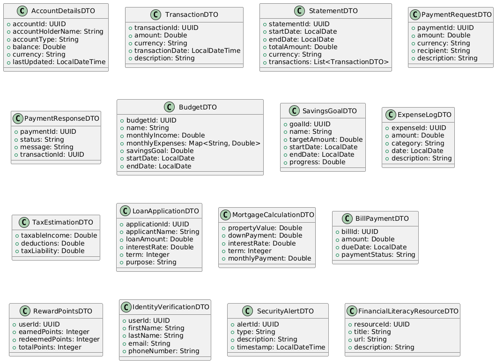
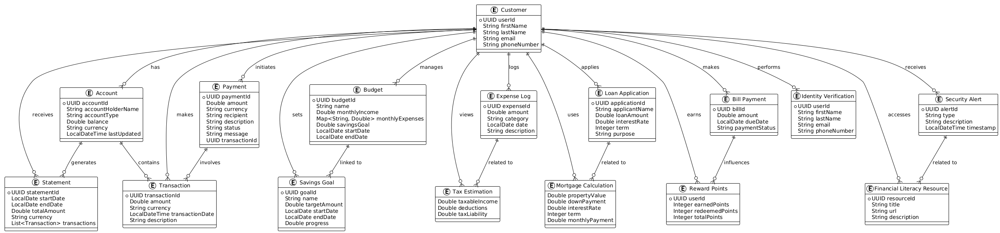
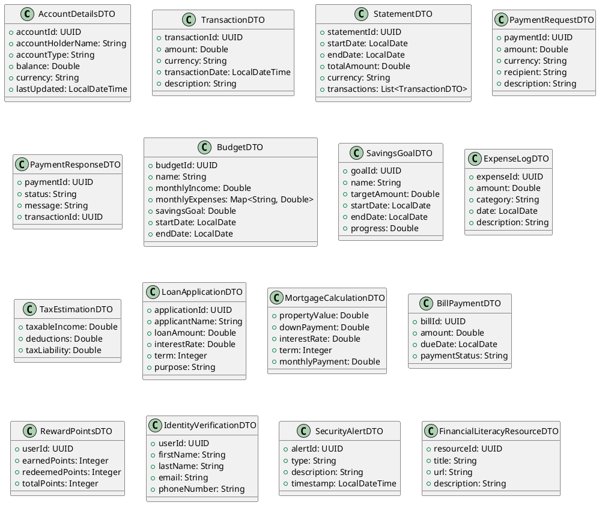

# Visualization

The following plantuml code was generated with GenAI. It might contain errors. Use at your own risk.

## Class diagram

## Entity Relationship diagram

```plantuml
@startuml
class AccountDetailsDTO {
  +accountId: UUID
  +accountHolderName: String
  +accountType: String
  +balance: Double
  +currency: String
  +lastUpdated: LocalDateTime
}

class TransactionDTO {
  +transactionId: UUID
  +amount: Double
  +currency: String
  +transactionDate: LocalDateTime
  +description: String
}

class StatementDTO {
  +statementId: UUID
  +startDate: LocalDate
  +endDate: LocalDate
  +totalAmount: Double
  +currency: String
  +transactions: List<TransactionDTO>
}

class PaymentRequestDTO {
  +paymentId: UUID
  +amount: Double
  +currency: String
  +recipient: String
  +description: String
}

class PaymentResponseDTO {
  +paymentId: UUID
  +status: String
  +message: String
  +transactionId: UUID
}

class BudgetDTO {
  +budgetId: UUID
  +name: String
  +monthlyIncome: Double
  +monthlyExpenses: Map<String, Double>
  +savingsGoal: Double
  +startDate: LocalDate
  +endDate: LocalDate
}

class SavingsGoalDTO {
  +goalId: UUID
  +name: String
  +targetAmount: Double
  +startDate: LocalDate
  +endDate: LocalDate
  +progress: Double
}

class ExpenseLogDTO {
  +expenseId: UUID
  +amount: Double
  +category: String
  +date: LocalDate
  +description: String
}

class TaxEstimationDTO {
  +taxableIncome: Double
  +deductions: Double
  +taxLiability: Double
}

class LoanApplicationDTO {
  +applicationId: UUID
  +applicantName: String
  +loanAmount: Double
  +interestRate: Double
  +term: Integer
  +purpose: String
}

class MortgageCalculationDTO {
  +propertyValue: Double
  +downPayment: Double
  +interestRate: Double
  +term: Integer
  +monthlyPayment: Double
}

class BillPaymentDTO {
  +billId: UUID
  +amount: Double
  +dueDate: LocalDate
  +paymentStatus: String
}

class RewardPointsDTO {
  +userId: UUID
  +earnedPoints: Integer
  +redeemedPoints: Integer
  +totalPoints: Integer
}

class IdentityVerificationDTO {
  +userId: UUID
  +firstName: String
  +lastName: String
  +email: String
  +phoneNumber: String
}

class SecurityAlertDTO {
  +alertId: UUID
  +type: String
  +description: String
  +timestamp: LocalDateTime
}

class FinancialLiteracyResourceDTO {
  +resourceId: UUID
  +title: String
  +url: String
  +description: String
}

@enduml
```

```plantuml
@startuml
!theme plain

entity "Customer" as Customer {
+ UUID userId
String firstName
String lastName
String email
String phoneNumber
}

entity "Account" {
+ UUID accountId
String accountHolderName
String accountType
Double balance
String currency
LocalDateTime lastUpdated
}

entity "Transaction" {
+ UUID transactionId
Double amount
String currency
LocalDateTime transactionDate
String description
}

entity "Statement" {
+ UUID statementId
LocalDate startDate
LocalDate endDate
Double totalAmount
String currency
List<Transaction> transactions
}

entity "Payment" {
+ UUID paymentId
Double amount
String currency
String recipient
String description
String status
String message
UUID transactionId
}

entity "Budget" {
+ UUID budgetId
String name
Double monthlyIncome
Map<String, Double> monthlyExpenses
Double savingsGoal
LocalDate startDate
LocalDate endDate
}

entity "Savings Goal" {
+ UUID goalId
String name
Double targetAmount
LocalDate startDate
LocalDate endDate
Double progress
}

entity "Expense Log" {
+ UUID expenseId
Double amount
String category
LocalDate date
String description
}

entity "Tax Estimation" {
Double taxableIncome
Double deductions
Double taxLiability
}

entity "Loan Application" {
+ UUID applicationId
String applicantName
Double loanAmount
Double interestRate
Integer term
String purpose
}

entity "Mortgage Calculation" {
Double propertyValue
Double downPayment
Double interestRate
Integer term
Double monthlyPayment
}

entity "Bill Payment" {
+ UUID billId
Double amount
LocalDate dueDate
String paymentStatus
}

entity "Reward Points" {
+ UUID userId
Integer earnedPoints
Integer redeemedPoints
Integer totalPoints
}

entity "Identity Verification" {
+ UUID userId
String firstName
String lastName
String email
String phoneNumber
}

entity "Security Alert" {
+ UUID alertId
String type
String description
LocalDateTime timestamp
}

entity "Financial Literacy Resource" {
+ UUID resourceId
String title
String url
String description
}

Customer ||--o{ Account : has
Customer ||--o{ Transaction : makes
Customer ||--o{ Statement : receives
Customer ||--o{ Payment : initiates
Customer ||--o{ Budget : manages
Customer ||--o{ "Savings Goal" : sets
Customer ||--o{ "Expense Log" : logs
Customer ||--o{ "Tax Estimation" : views
Customer ||--o{ "Loan Application" : applies
Customer ||--o{ "Mortgage Calculation" : uses
Customer ||--o{ "Bill Payment" : makes
Customer ||--o{ "Reward Points" : earns
Customer ||--o{ "Identity Verification" : performs
Customer ||--o{ "Security Alert" : receives
Customer ||--o{ "Financial Literacy Resource" : accesses

Account ||--o{ Transaction : contains
Account ||--o{ Statement : generates

Payment ||--o{ Transaction : involves

Budget ||--o{ "Savings Goal" : linked to

"Expense Log" ||--o{ "Tax Estimation" : related to

"Loan Application" ||--o{ "Mortgage Calculation" : related to

"Bill Payment" ||--o{ "Reward Points" : influences

"Security Alert" ||--o{ "Financial Literacy Resource" : related to

@enduml
```